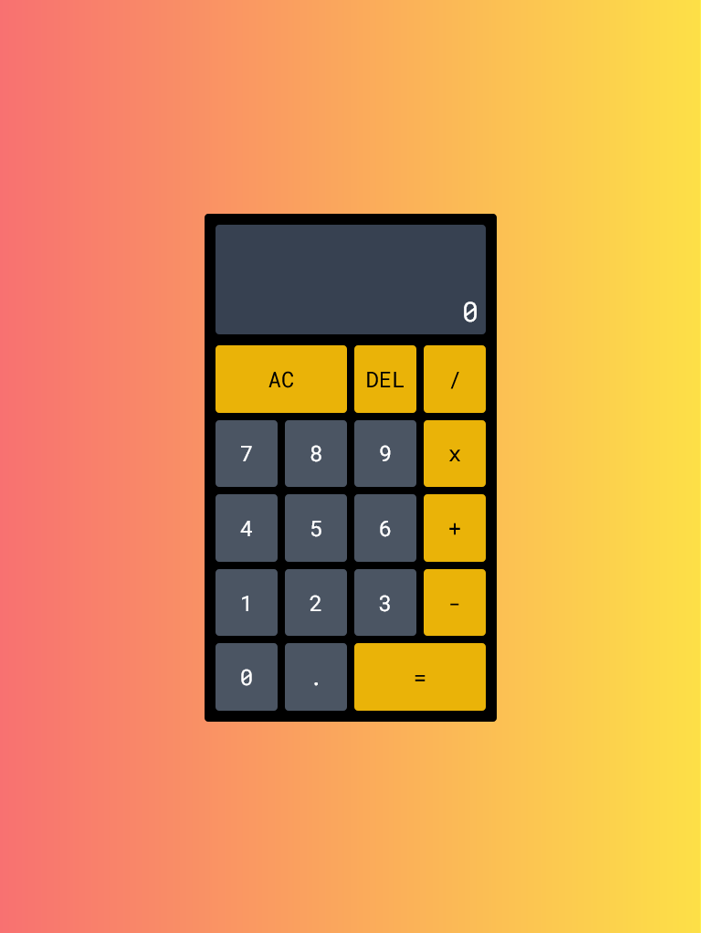

# Calculator App

Build a calculator using React, Redux Toolkit and TypeScript.

用 React、Redux Toolkit、TypeScript 開發簡易計算機，藉此練習 TypeScript 的運用。

## Table of contents

-   [Table of contents](#table-of-contents)
-   [Overview](#overview)
    -   [The challenge](#the-challenge)
    -   [Screenshot](#screenshot)
    -   [Links](#links)
-   [My process](#my-process)
    -   [Built with](#built-with)
    -   [What I learned](#what-i-learned)
    -   [Useful resources](#useful-resources)
-   [Author](#author)

## Overview

### The challenge

-   The calculator should contain clickable elements, including an = (equal sign), one number each from 0 to 9, one of the 4 primary mathematical operators (+, -, \*, /), a . (decimal point) symbol, an AC (clear), and a DEL (delete) button.
-   The calculator should not allow a number to begin with multiple zeros.
-   The calculator should not allow two . in one number.
-   If 2 or more operators are entered consecutively, the operation performed should be based on the last operator entered (excluding the negative (-) sign).
-   Pressing an operator immediately following = should start a new calculation that operates on the result of the previous evaluation.
-   The calculator should utilize formula logic.

Users should be able to:

-   Perform addition, subtraction, multiplication, and division on a chain of numbers of any length.
-   Upon pressing =, the correct result should be displayed.
-   Press the clear button to clear both the input and output values.
-   Press the delete button to remove the previous input.

### Screenshot



### Links

-   Live Site URL: [https://yj-calculator.netlify.app/](https://yj-calculator.netlify.app/)

## My process

### Built with

-   [React](https://reactjs.org/)
-   [Redux Toolkit](https://redux-toolkit.js.org/)
-   [TypeScript](https://www.typescriptlang.org/)
-   [Tailwind CSS](https://tailwindcss.com/)
-   Mobile-first workflow
-   Google fonts
-   [Vite](https://vitejs.dev/)
-   [Netlify](https://www.netlify.com/)

### What I learned

-   Use TypeScript in Redux Toolkit.

```ts
// app/app.tsx
export const store = configureStore({
    reducer: {
        calculator: calculatorReducer,
    },
});

export type RootState = ReturnType<typeof store.getState>;
export type AppDispatch = typeof store.dispatch;

// app/hooks.tsx
export const useAppDispatch = useDispatch.withTypes<AppDispatch>();
export const useAppSelector = useSelector.withTypes<RootState>();

// feature/calculator/calculatorSlice.tsx
export interface CalculatorState {
    formula: string[]; // 已輸入公式
    display: string; // 目前輸入值
    isEnd: boolean; // 是否已結束
}

const initialState: CalculatorState = {
    formula: [],
    display: "",
    isEnd: false,
};

export const calculatorSlice = createSlice({
    name: "calculator",
    initialState,
    ...
});
```

-   Use slice selectors in Redux Toolkit.

```ts
// feature/calculator/calculatorSlice.tsx
export const calculatorSlice = createSlice({
    name: "calculator",
    initialState,
    reducers: {
    ...
    },

    selectors: {
        selectFormula: (calculator) => calculator.formula,
        selectDisplay: (calculator) => calculator.display,
    },
});
...

export const { selectFormula, selectDisplay } = calculatorSlice.selectors;

// feature/calculator/CalculatorResult.tsx
const CalculatorResult = () => {
    const formula = useAppSelector(selectFormula);
    const display = useAppSelector(selectDisplay);
    ...
};
```

-   Use TypeScript in React Components.

```ts
// feature/calculator/OperatorButton.tsx
type OperatorProps = {
    id: string;
    value: string;
    span?: boolean;
};

const OperatorButton = ({ id, value, span = false }: OperatorProps) => {
    const dispatch = useAppDispatch();
    ...
};
```

-   Use TypeScript in functions.

```ts
// feature/calculator/helpers.tsx
// 檢查運算子
export const isOperator = (str: string): boolean => {
    const reg = /[+\-x/]/;
    return str.length === 1 && reg.test(str);
};

// 處理精度運算
const getBaseNumber = (num1: number, num2: number): number => {
    const num1Digits = (num1.toString().split(".")[1] || "").length;
    const num2Digits = (num2.toString().split(".")[1] || "").length;

    return Math.pow(10, Math.max(num1Digits, num2Digits));
};
```

### Useful resources

-   [TypeScript Crash Course](https://www.youtube.com/watch?v=BCg4U1FzODs)
-   [React TypeScript Cheatsheets](https://react-typescript-cheatsheet.netlify.app/)
-   [[Js 地下城]計算機(Calculator) — 使用 React Redux 與後序式](https://medium.com/tomsnote/js%E5%9C%B0%E4%B8%8B%E5%9F%8E-%E8%A8%88%E7%AE%97%E6%A9%9F-calculator-%E4%BD%BF%E7%94%A8react-redux%E8%88%87%E5%BE%8C%E5%BA%8F%E5%BC%8F-c360decd3204)
-   [JavaScript 浮点数陷阱及解法](https://github.com/camsong/blog/issues/9)

## Author

-   GitHub - [@YingJhen-Su](https://github.com/YingJhen-Su)
-   freeCodeCamp - [@YJS](https://www.freecodecamp.org/YJS)
-   CodePen - [@YJ1997](https://codepen.io/YJ1997)
-   Frontend Mentor - [@YingJhen-Su](https://www.frontendmentor.io/profile/YingJhen-Su)
